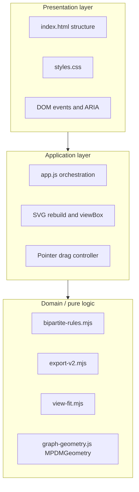

# Mini Pipeline Diagram Maker — design document

This document describes **architecture**, **rendering strategy**, and **session state** at a high level, plus information architecture and visual design. **All normative behavior and acceptance tests** are in **`SPEC.md`** (especially **§4 JSON**, **§5–9** mechanics, and **§10 Scenarios S-001–S-034**).

---

## 1. Product summary

**Mini Pipeline Diagram Maker** is a browser-only editor for small **data/pipeline** diagrams. Users place **Processes** (steps) and **Files** (artifacts) and connect them with links. The graph is **bipartite**: links only connect a Process to a File. There is no execution engine, backend, or account system.

**User goals**

- Model pipelines as Process ↔ File relationships.
- Refine layout by **dragging** nodes or running **Cleanup** (automatic layered layout).
- **Save** and **reload** JSON, including **stored positions** (`x`, `y` on every node in exports).

**Acceptance:** Implementations should satisfy every **Scenario** in `SPEC.md` §10.

---

## 2. System architecture

### 2.1 Layered structure

- **Presentation:** static shell, layout, tokens, accessibility hints. No business rules.  
- **Application:** holds session state, wires controls, translates user input into calls to pure functions, drives rendering.  
- **Domain:** deterministic helpers — validation, normalization, export payload, viewport fit math, cleanup placement, bounds. **No DOM, no globals** except `graph-geometry.js`, which attaches **`MPDMGeometry`** to `globalThis` for the browser and tests.

### 2.2 Dependency rules

| Module | May import / use |
|--------|-------------------|
| `app.js` | `bipartite-rules.mjs`, `export-v2.mjs`, `view-fit.mjs`, `globalThis.MPDMGeometry` |
| `bipartite-rules.mjs` | (none) |
| `export-v2.mjs` | (none) |
| `view-fit.mjs` | (none) |
| `graph-geometry.js` | (none; IIFE) |

**Bootstrap order:** `graph-geometry.js` (script) **before** `app.js` (type="module"). If `MPDMGeometry` is absent when `app.js` runs, fail fast (**Scenario S-032**).

### 2.3 Data flow (high level)

1. **User action** (click, drag, key, file pick) → `app.js` handler.  
2. Handler updates **mutable session state** (diagram arrays, position maps, selection, viewport flags) or calls **pure** `validate*`, `normalize*`, `buildV2Export`, `computeViewBoxFit`, `rebuildBipartiteCleanup`.  
3. **`syncUi`** (or equivalent) refreshes toolbar widgets, inspector, and runs **`renderSvg`**.  
4. **Persistence:** load path parses JSON → validate → normalize → replace diagram → positions from file or Cleanup; save path → `buildV2Export` → Blob download.

---

## 3. State model (session)

### 3.1 Document vs layout vs chrome

| Concern | Contents | Persisted in JSON |
|---------|----------|-------------------|
| **Diagram data** | `processes[]`, `files[]`, `links[]` | Yes (`version`, nodes, links) |
| **Layout** | `posProcess`, `posFile` maps | Yes (`x`, `y` on each node when saved) |
| **Selection** | `{ kind, id }` or `null` | No |
| **Viewport** | `viewBox` (x, y, w, h) + `userAdjusted` boolean | No |
| **Drag** | ephemeral pointer baseline | No |

**Invariant:** Every Process and File `id` in the diagram arrays has a corresponding entry in its position map after any successful load or layout operation (Cleanup or coordinates from file).

### 3.2 Derived vs authoritative

- **Authoritative:** arrays, maps, selection, `graphView` / `userAdjusted`.  
- **Derived on render:** SVG children, inspector text, dropdown options, disabled state of Delete, intrinsic SVG width/height from §3.5 of **SPEC**, fit `viewBox` when `userAdjusted === false`.

### 3.3 Load failure and rollback

**Reference behavior:** `validateV2Payload` runs **before** diagram state is replaced; if it fails, nothing in `processes` / `files` / `links` / position maps / selection changes (**Scenario S-022**). The code may still keep a **clone** of state for restore; for the current implementation, that restore is redundant on validation errors because mutation happens only after a successful validate. **Viewport** (`graphView`) is **not** cloned on load attempt; a failed load therefore leaves the viewport as it was.

---

## 4. Rendering approach

### 4.1 Strategy: full SVG rebuild

On each sync/render cycle the implementation **clears** the SVG and **recreates** all graphical children. There is no retained per-node DOM pool or virtual DOM framework.

**Rationale:** Diagrams are small; correctness and simplicity outweigh incremental patching.

### 4.2 Layer order (z-index inside SVG)

Bottom to top:

1. **Links** — `<g class="links">` so edges sit under nodes.  
2. **Processes** — `<g class="processes">`.  
3. **Files** — `<g class="files">`.

Each **link** is a group: invisible **wide** stroke path for hits, then visible **line** path. Process/File groups: shape + label + enlarged **hit** geometry.

### 4.3 ViewBox and intrinsic size

- **`width` / `height` attributes** on `<svg>`: derived from content bounds (**SPEC** §3.5) so the coordinate system has a nominal document size.  
- **`viewBox`**: defines the **visible** rectangle; updated by **auto-fit** or **user zoom**.  
- **Reset zoom** clears the user-zoom flag so the next render recomputes fit from content + link segments (**SPEC** §5).

### 4.4 Coordinate pipeline

1. Pointer events in **client** space → `getScreenCTM().inverse()` (or equivalent) → **SVG user** coordinates.  
2. Drag applies deltas in **user** space to `posProcess` / `posFile`.  
3. Edge geometry recompute uses the same `NODE_R`, `FILE_W`, `FILE_H` as **SPEC** §3.

### 4.5 Visual styling

Concrete colors, radii, typography, and focus rings live in **`styles.css`** (CSS variables). **SPEC** defines only behavioral truncation limits and selection emphasis conceptually; pixel values follow the stylesheet.

---

## 5. Interaction architecture

- **Toolbar / main controls:** mutate **diagram** and **I/O** only; no direct SVG manipulation except through state + re-render.  
- **Graph controls:** **Reset zoom** (viewport only), **Cleanup** (positions only, validated first).  
- **Pointer:** `mousedown` on node starts **window-level** move/up listeners so drag continues outside the SVG.  
- **Keyboard:** global **Delete**/**Backspace** guarded so typing in fields is not treated as graph delete (**SPEC** §9).

---

## 6. Information architecture (screen layout)

### 6.1 Regions

1. **Header** — title + short tagline (bipartite, local-only).  
2. **Main controls** (`data-testid="main-controls"`) — create nodes, link pickers, delete, sample/load/save, status.  
3. **Workspace** — responsive grid:  
   - **Canvas column** — graph controls + SVG card + hint text.  
   - **Inspector** — selection details + connections list.

### 6.2 Graph controls (`data-testid="graph-controls"`)

Labeled **Graph**: **Reset zoom**, **Cleanup** only — separates **view** operations from **document** edits.

---

## 7. Technology stack

| Layer | Technology |
|-------|------------|
| UI shell | HTML5 |
| Styling | CSS |
| App | Vanilla JS ES module + one global geometry script |
| Tests | Node `node --test`; pure modules tested without browser |

Serve over HTTP(S) so **ES modules** resolve; `file://` is fragile for `import`.

---

## 8. Code map (maintainer view)

| File | Role |
|------|------|
| `index.html` | Regions, `aria`, script order |
| `styles.css` | Layout grid, theme, component styles |
| `graph-geometry.js` | `MPDMGeometry`: cleanup, bounds, default placement |
| `app.js` | State, DOM, SVG render, drag, load/save |
| `bipartite-rules.mjs` | Validation, normalization, layout detection |
| `export-v2.mjs` | v2 JSON build with coordinates |
| `view-fit.mjs` | `computeViewBoxFit`, shared endpoint math for bbox |
| `sample-pipeline.json` | Manual / sample reference |

---

## 9. Persistence UX

- **Save:** build **SPEC** §4.4 payload → download `mini-pipeline.json`.  
- **Load:** file text → parse → validate → normalize → positions or Cleanup; failure rolls back (**SPEC** §4.3, S-022).  
- **Sample:** inlined v2 diagram without coordinates — same effect as loading `sample-pipeline.json`.

---

## 10. Design-level scenarios (non-duplicative)

These mirror **SPEC** §10 but name **architectural** expectations. Detailed **Given/When/Then** remains in **SPEC**.

| ID | Design concern |
|----|----------------|
| **D-001** | **Separation:** Cleanup and validation live in pure modules testable without DOM (S-015, S-016). |
| **D-002** | **Single render path:** Every mutation that affects the graph goes through one sync path ending in SVG rebuild (S-012, S-017). |
| **D-003** | **Bootstrap contract:** Geometry global must exist before module app (S-032). |
| **D-004** | **State rollback:** Failed load does not partially apply (S-022). |
| **D-005** | **Persistence boundary:** Only `bipartite-rules` + `export-v2` interpret JSON schema (S-020–S-028). |

---

## 11. Operational notes

- Local static server (see `README.md`).  
- `npm test` exercises pure logic aligned with **SPEC**.  
- Optional `tests/browser-smoke.html` for manual smoke checks.

For **JSON schema**, coordinates, algorithms, and full acceptance coverage, **`SPEC.md`** is authoritative.
